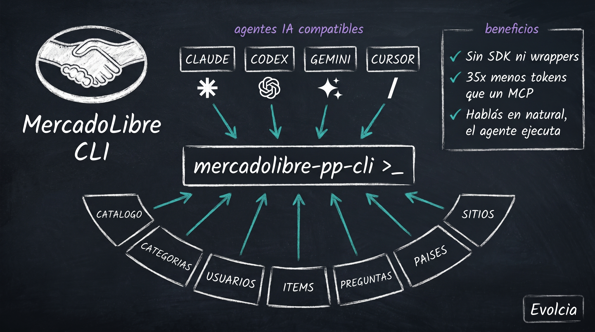

<div align="center">



# mercadolibre-pp-cli

**CLI cross-platform para la API de MercadoLibre — pensada para humanos, agentes de IA y pipelines.**

Recorré el catálogo canónico de cualquier marketplace de LATAM (Argentina, Brasil, México, Chile, Colombia, Uruguay, Perú…), inspeccioná el árbol de categorías, traé detalle de productos, listá publicaciones de vendedores y respondé preguntas — todo desde la terminal.

Compatible con **Claude Code, Codex, Gemini CLI, Cursor y cualquier agente** que pueda invocar una CLI o leer la convención `SKILL.md` de [agent-skills.io](https://agent-skills.io).

[](https://go.dev)
[](https://github.com/LeaCast/mercadolibre-pp-cli/releases)
[](https://github.com/LeaCast/mercadolibre-pp-cli/releases/latest)
[](LICENSE)
[](https://printingpress.dev)

</div>

---

## ¿Qué problema resuelve?

La API de MercadoLibre es potente pero **está gateada detrás de OAuth, códigos de sitio por país, y un portal de documentación fragmentado**. Construir integraciones implica:

- Escribir scripts curl una y otra vez, redescubriendo los mismos patrones de paginación.
- Usar la API REST cruda directo desde el IDE / agente / pipeline, sin type safety, sin caché, sin mirror offline.
- Instalar SDKs pesados en Python / JS / Java solamente para hacer `GET /products/search`.

Esta CLI resuelve eso dándote **un solo binario** que:

- Habla todos los endpoints relevantes de ML con flags consistentes (`--site-id MLA`, `--limit`, `--offset`, `--json`).
- Maneja tokens OAuth Bearer vía env var o archivo de config (rotás sin tocar código).
- Espeja respuestas de la API a un store SQLite local on-demand (`sync`) para workflows offline / analytics.
- Emite JSON estructurado o output compacto agent-friendly (`--agent`).
- Genera un árbol de help Cobra-style en cada nivel (`--help` en todos lados).
- Trae un `SKILL.md` que cualquier agente compatible con [agent-skills.io](https://agent-skills.io) descubre e invoca nativamente.

## ¿Para quién es?

- **Agentes de IA (Claude Code, Codex, Gemini CLI, Cursor, etc.)** que necesitan una interfaz token-efficient y predecible para ML. Las CLIs usan ~35× menos tokens que los MCP equivalentes para la misma tarea (según [benchmarks de Printing Press](https://printingpress.dev)).
- **Devs que construyen integraciones con ML** y quieren una herramienta rápida de inspección read-only mientras prototipan, más un fetcher de datos confiable en producción.
- **Vendedores / power users** que quieren consultar sus propias publicaciones, monitorear precios del catálogo o responder preguntas pendientes sin salir de la terminal.
- **Analistas de datos** que minan el catálogo público de ML (más de 10.000 productos por keyword en MLA solamente) para pricing intelligence, research de categorías o análisis competitivo.

## Quick start (30 segundos)

```bash
# 1. Instalar (cualquier plataforma — ver sección Instalación)
go install github.com/LeaCast/mercadolibre-pp-cli/cmd/mercadolibre-pp-cli@latest

# 2. Endpoint público — sin auth
mercadolibre-pp-cli countries list --json

# 3. Endpoint autenticado — seteá el token primero
export MERCADOLIBRE_ACCESS_TOKEN="<tu-token>"
mercadolibre-pp-cli catalog search --site-id MLA --q "iphone" --limit 5
```

Eso es todo. Saltá a [Autenticación](#autenticación) para el setup OAuth o a [Comandos disponibles](#comandos-disponibles) para la superficie completa.

## Instalación

### Opción 1 — `go install` (cualquier plataforma, requiere Go 1.26+)

```bash
go install github.com/LeaCast/mercadolibre-pp-cli/cmd/mercadolibre-pp-cli@latest
```

Asegurate de que `$(go env GOPATH)/bin` esté en tu `PATH`.

### Opción 2 — Binarios pre-compilados (sin Go)

Descargá desde el [último release](https://github.com/LeaCast/mercadolibre-pp-cli/releases/latest):

| Plataforma | Binario |
|------------|---------|
| Linux x86_64 | `mercadolibre-pp-cli_<version>_linux_amd64.tar.gz` |
| Linux ARM64 | `mercadolibre-pp-cli_<version>_linux_arm64.tar.gz` |
| macOS Intel | `mercadolibre-pp-cli_<version>_darwin_amd64.tar.gz` |
| macOS Apple Silicon | `mercadolibre-pp-cli_<version>_darwin_arm64.tar.gz` |
| Windows x86_64 | `mercadolibre-pp-cli_<version>_windows_amd64.zip` |
| Windows ARM64 | `mercadolibre-pp-cli_<version>_windows_arm64.zip` |

> ℹ️ Los archivos `darwin_*` son para **macOS** (Go usa `darwin` como identificador interno del kernel; es la misma plataforma).

Extraé y mové el binario a tu `PATH`:

```bash
# Linux / macOS
chmod +x mercadolibre-pp-cli && sudo mv mercadolibre-pp-cli /usr/local/bin/

# macOS — paso extra por Gatekeeper
xattr -d com.apple.quarantine /usr/local/bin/mercadolibre-pp-cli
```

```powershell
# Windows
Move-Item .\mercadolibre-pp-cli.exe "$env:USERPROFILE\bin\"
# (asegurate de que %USERPROFILE%\bin esté en PATH)
```

### Opción 3 — Instalador de Printing Press (cross-platform, incluye la skill para agentes)

```bash
npx -y @mvanhorn/printing-press-library install mercadolibre
```

Instala el binario **y** el SKILL.md en el directorio de skills de tu agente automáticamente.

### Opción 4 — Desde el código fuente

```bash
git clone https://github.com/LeaCast/mercadolibre-pp-cli.git
cd mercadolibre-pp-cli
go build -o mercadolibre-pp-cli ./cmd/mercadolibre-pp-cli
```

## Autenticación

### Endpoints públicos (sin auth)

Algunos endpoints funcionan sin credenciales:

```bash
mercadolibre-pp-cli countries list                    # lista todos los países de ML
mercadolibre-pp-cli countries get AR                  # detalle de un país
```

### OAuth 2.0 (requerido para todo lo demás)

MercadoLibre cerró la mayoría de su API pública en 2024. Catalog search, detalle de items, perfiles de usuario y preguntas requieren un token Bearer OAuth.

**1. Creá una aplicación** en https://developers.mercadolibre.com/devcenter (o `.com.ar`, `.com.mx`, etc.). Configurá:
- Redirect URI: `https://httpbin.org/get` (para testing) o tu propia URL de callback.
- Flujos OAuth: habilitá **Authorization Code**, **Refresh Token** y **Client Credentials**.
- Permisos: como mínimo **Usuarios** (lectura) — agregá más según tu caso de uso.

ML te va a dar un **App ID** y un **Client Secret**.

**2. Obtené un access token** vía el flujo de authorization code:

Abrí en tu browser:
```
https://auth.mercadolibre.com.ar/authorization?response_type=code&client_id=<tu-app-id>&redirect_uri=https%3A%2F%2Fhttpbin.org%2Fget
```

Autorizá la app. ML te redirige a `https://httpbin.org/get?code=<authorization-code>`. Copiá el `code` (vive 6 minutos).

Intercambiá el code por un token:
```bash
curl -X POST https://api.mercadolibre.com/oauth/token \
  -H "Accept: application/json" \
  -H "Content-Type: application/x-www-form-urlencoded" \
  -d "grant_type=authorization_code" \
  -d "client_id=<tu-app-id>" \
  -d "client_secret=<tu-client-secret>" \
  -d "code=<authorization-code>" \
  -d "redirect_uri=https://httpbin.org/get"
```

Obtenés un `access_token` (válido 6 horas), un `refresh_token` (válido 6 meses) y tu `user_id`.

**3. Guardá el token** para la CLI:

```bash
mercadolibre-pp-cli auth set-token "<tu-access-token>"
```

O seteá una variable de entorno en cada sesión:

```bash
export MERCADOLIBRE_ACCESS_TOKEN="<tu-access-token>"
```

**4. Verificá:**

```bash
mercadolibre-pp-cli auth status
mercadolibre-pp-cli users get <tu-user-id>
```

### Refrescar el token

Cuando el access token expira (6 h):
```bash
curl -X POST https://api.mercadolibre.com/oauth/token \
  -d "grant_type=refresh_token" \
  -d "client_id=<tu-app-id>" \
  -d "client_secret=<tu-client-secret>" \
  -d "refresh_token=<tu-refresh-token>"
```

Guardá el nuevo access_token. (Un helper de un solo comando para esto está en el roadmap.)

## Comandos disponibles

```
mercadolibre-pp-cli
├── auth          Gestionar autenticación (status, set-token, logout)
├── countries     Listar países / detalle de país (público — sin auth)
├── sites         Listar sitios MercadoLibre (MLA, MLB, MLM, MLC, MLU, …)
├── catalog       Buscar y traer detalle del catálogo canónico (OAuth)
│   ├── search    Buscar productos por keyword en un sitio (devuelve 10K+ por keyword)
│   └── get       Detalle completo de un producto (atributos, fotos, descripciones)
├── categories    Taxonomía de categorías (OAuth)
│   ├── list-by-site  Categorías raíz de un sitio
│   └── get           Detalle de categoría con path completo desde root
├── users         Perfiles de usuario y vendedor (OAuth)
│   ├── get       Perfil, reputación, fecha de registro
│   └── items     Publicaciones activas de un vendedor
├── items         Publicaciones individuales del marketplace (OAuth)
│   └── get       Detalle completo de una publicación (precio, stock, fotos, vendedor)
├── questions     Q&A en tus publicaciones (OAuth — escritura requiere scope extra)
│   ├── list      Listar preguntas filtradas por vendedor / estado
│   └── answer    Responder una pregunta específica
├── sync          Espejar respuestas de la API a SQLite local (offline / analytics)
├── search        Full-text search sobre los datos sincronizados
├── export        Exportar data local a JSONL / JSON
├── doctor        Diagnosticar auth, conectividad, config
└── version       Imprimir versión
```

Cada comando soporta `--help`. Corré `mercadolibre-pp-cli api` para navegar todos los recursos de forma programática (diseñado para agentes).

## Workflows comunes

### Pricing intelligence sobre una categoría

```bash
# ¿Qué devuelve "iphone" en Argentina?
mercadolibre-pp-cli catalog search --site-id MLA --q "iphone" --limit 50 --json | \
  jq '.results.results[] | {id, name, status, date_created}'
```

### Inspeccionar qué está ofreciendo un vendedor

```bash
mercadolibre-pp-cli users items <seller-id> --json
```

### Traer atributos completos de un producto

```bash
mercadolibre-pp-cli catalog get <product-id> --json
```

### Responder una pregunta pendiente

```bash
mercadolibre-pp-cli questions list --seller-id <tu-user-id> --status UNANSWERED --json
mercadolibre-pp-cli questions answer --question-id <id> --text "Sí, tengo stock disponible."
```

### Espejar datos local para análisis offline

```bash
mercadolibre-pp-cli sync catalog --site-id MLA --q "decoración"
mercadolibre-pp-cli search --q "centro de mesa"     # consulta el mirror local
```

## Uso desde agentes de IA

Esta CLI trae un `SKILL.md` que sigue la convención de [agent-skills.io](https://agent-skills.io), así que cualquier agente compatible con ese estándar la descubre e invoca nativamente.

### Claude Code

Cuando instalás vía el installer de Printing Press (Opción 3), la skill se auto-registra. Después podés pedirle a Claude en lenguaje natural:

> "Buscá en el catálogo de MercadoLibre 'centro de mesa dorado' en Argentina, traeme los 10 primeros con precio."

### Codex, Cursor, Gemini CLI, otros

Estos agentes descubren archivos SKILL.md en sus directorios de skills. Después de instalar la CLI, copiá `SKILL.md` a la carpeta de skills de tu agente (la ubicación varía por agente — mirá los docs de tu agente). O instalá vía Printing Press con `--agent <nombre-agente>`:

```bash
npx -y @mvanhorn/printing-press-library install mercadolibre --agent codex
npx -y @mvanhorn/printing-press-library install mercadolibre --agent gemini-cli
```

### Invocación genérica (cualquier agente)

Si tu agente tiene acceso a bash/shell, no necesitás integración especial — invocá la CLI directo:

```bash
mercadolibre-pp-cli <comando> --agent --json
```

El flag `--agent` habilita output JSON, desactiva prompts interactivos, suprime códigos de color y asume confirmación — perfecto para automatización no-interactiva.

## Caveats

### Gating de la API de MercadoLibre

Desde 2024, **la mayoría** de los endpoints de ML requieren OAuth. Algunos están restringidos aún más:

- `/sites/{site}/search` (búsqueda de publicaciones del marketplace) está **bloqueado para apps no certificadas** incluso con OAuth válido. Usá `catalog search` (el catálogo canónico de productos) en su lugar — devuelve data más rica de todos modos.
- `/orders/search` requiere el scope **`read orders`**, que tenés que habilitar explícitamente en los permisos de tu app en DevCenter ("Métricas del negocio" / "Venta y envíos") y re-autorizar. NO está incluido en esta CLI por default; usuarios avanzados pueden agregarlo editando el spec y regenerando.
- Los rate limits son por app y por usuario; mirá los [docs oficiales de rate-limit de ML](https://developers.mercadolibre.com/en_us/policies-of-use).

### Cobertura de sitios

Los códigos de sitio siguen la convención de ML: `MLA` = Argentina, `MLB` = Brasil, `MLM` = México, `MLC` = Chile, `MLU` = Uruguay, `MCO` = Colombia, `MPE` = Perú, `MLV` = Venezuela, etc. Corré `mercadolibre-pp-cli sites list` para la lista completa.

### Almacenamiento del token

Por default, los tokens se guardan en `~/.config/mercadolibre-pp-cli/config.toml` (modo `0600`). Usá la env var `MERCADOLIBRE_ACCESS_TOKEN` si preferís no escribir al disco (ej. en CI/CD).

## Contribuir

Las contribuciones son bienvenidas — esta CLI fue generada con [Printing Press](https://printingpress.dev) desde un spec hand-authored en [`spec.yaml`](spec.yaml). Para agregar un endpoint:

1. Editá el spec declarando el nuevo recurso / endpoint.
2. Corré `printing-press generate --spec spec.yaml --name mercadolibre --force --validate=false`.
3. Compilá: `go build -o mercadolibre-pp-cli ./cmd/mercadolibre-pp-cli`.
4. Smoke test al comando nuevo y abrí un PR.

Reportes de bugs y feature requests: [GitHub Issues](https://github.com/LeaCast/mercadolibre-pp-cli/issues).

## Changelog

### v0.1.1 (2026-05-24)
- **fix:** Omitir header `Authorization` en endpoints públicos (`/classified_locations/*`). Antes el CLI mandaba el token Bearer aunque el endpoint no lo requería, y MercadoLibre rechazaba con HTTP 401 si el token estaba vencido (vida útil 6 h). Ahora `countries list` y `countries get` funcionan **sin token, con token vencido o con token inválido**. `catalog search` y demás endpoints autenticados siguen funcionando igual. Detalles del parche en [`.printing-press-patches.json`](.printing-press-patches.json).

### v0.1.0 (2026-05-24)
- Release inicial. 7 recursos: `catalog`, `categories`, `countries`, `sites`, `users`, `items`, `questions`. 6 binarios cross-platform (Linux, macOS, Windows × amd64/arm64).

## Licencia

MIT — ver [LICENSE](LICENSE).

## Agradecimientos

- Construido con [Printing Press](https://printingpress.dev) por [@mvanhorn](https://github.com/mvanhorn) y contribuyentes.
- API: [MercadoLibre Developers](https://developers.mercadolibre.com).
- Mantenedor: [@LeaCast](https://github.com/LeaCast).
